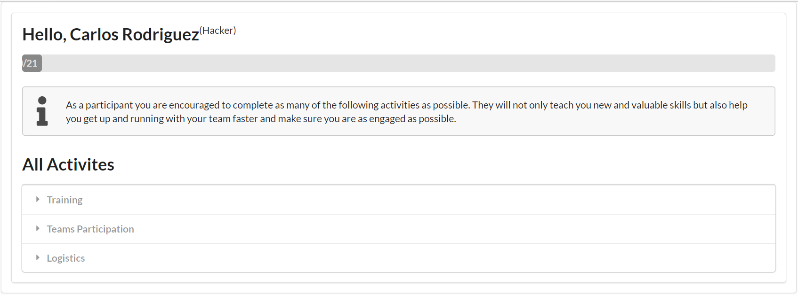
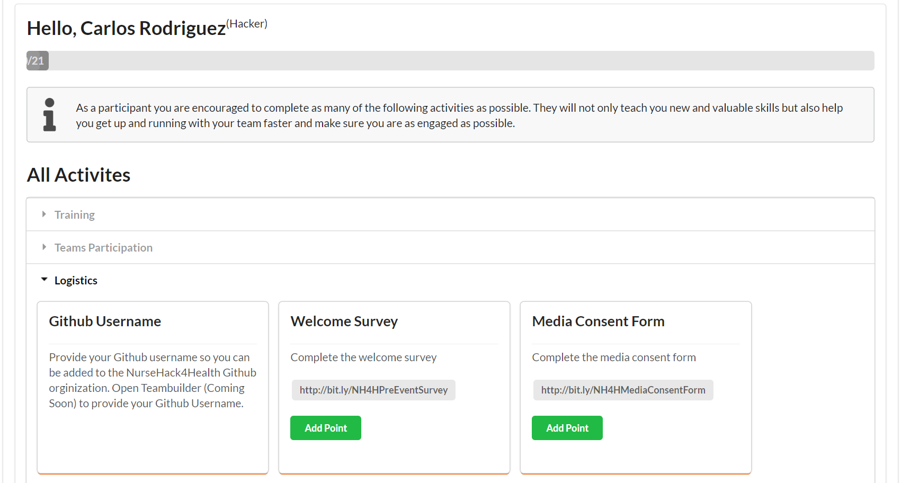
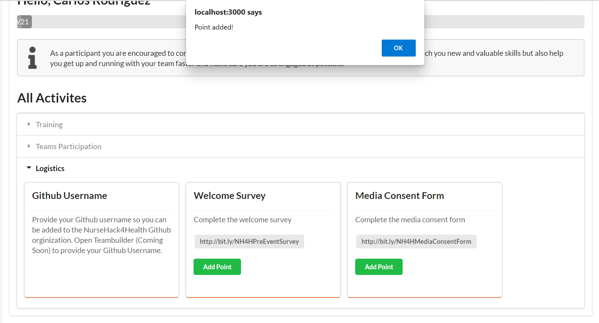

# Introduction 
TODO: Give a short introduction of your project. Let this section explain the objectives or the motivation behind this project. 

# Getting Started
TODO: Guide users through getting your code up and running on their own system. In this section you can talk about:
1.	Installation process
2.	Software dependencies
3.	Latest releases
4.	API references

# Build and Test
**Why?**
The purpose of this app is to track your participation in this hackathon. By tracking your progress through the app, you become aware of the various activities there are available to you throughout the event. Additionally, through your awareness, you become more engaged in all the components of the hackathon that are available to you as a participant.

All activities are categorized as training, team’s participation, and logistics. Across each respective category, these activities included will help educate you, collaborate with your team, and remain engaged with the event.

The bar on the top will start at 0/21. In other words, zero of the 21 activities have been completed. As each task is completed, the bar will advance until all activities are completed. 

Below is an example of completing two activities under the logistics category.

The two activities are the “Welcome Survey” and “Media Consent Form”. To complete these two activities, you are redirected to a separate page when you click each link. 

Upon completion of the survey and form, you return to the Gamification app. By simply clicking “Add Point”, your progress will be tracked on the bar. 

You are now at 2/21 activities completed.

Repeat this process for the remaining activities to achieve 21/21 activities completed.

# Ideas for Spring
* Maybe sort teams by least number of participants
* Add flag to indicate team is "full"
* Team create: check off what skills you're bringing to the team
* Team create:Team Description gets changed to problem pitch (keep away from solution and focus on problem)
* Team create: update problem types
* Team channel names maynot be autocreated
* Admin can associate a team to a channel
* Admin page / authorization 
* capture usage meterics for teams and users
* questions we want answers to: "how many searches are done?" "When were teams created?"" etc...

If you want to learn more about creating good readme files then refer the following [guidelines](https://docs.microsoft.com/en-us/azure/devops/repos/git/create-a-readme?view=azure-devops). You can also seek inspiration from the below readme files:
- [ASP.NET Core](https://github.com/aspnet/Home)
- [Visual Studio Code](https://github.com/Microsoft/vscode)
- [Chakra Core](https://github.com/Microsoft/ChakraCore)
